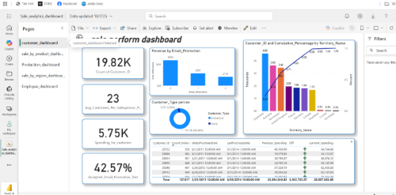

# Azure End to End Data Engineering Pipeline

This project builds an End-to-End Azure Data Engineering Solution. A Pipeline performing Data Ingestion, ETL and Analytics all-in-one solution using Microsoft Azure Services and Power BI.

## Goal of the Project

The goal is to create an Azure solution which can take an On-premise Database such as the Microsoft SQL Server Management System (SSMS) and move it to the Cloud. It does so by building an ETL pipeline using Azure Data Factory, Azure Databricks and Azure Synapse Analytics.

This solution can be connected to a visualization and reporting dashboard using Microsoft Power BI.

Data Migration to the Cloud is one of the most common scenarios the Data Engineers encounter when building solutions for a small-medium organization.
By working on this project, I was able to learn these skills:

* Data Ingestion
* ETL techniques using Azure Cloud Services
* Data Transformation
* Data Analytics and Dashboard Reporting
* Data Security and Governance

## Prerequisites:

1) Microsoft SQL Server Managment System (SSMS)
2) Azure Subscription (Azure Data Lake Storage Gen2, Azure Data Factory, Azure Key Vault, Azure Databricks, Azure Synapse Analytics, Microsoft Entra ID)
3) Microsoft Power BI
4) Set up "AdventureWorks2022" Database with credentials 'lochuu'. Set up the same credentials as Secrets in Azure Key Vault

The Database used for this project demonstration is:
AdventureWorks2022 Sales Database
[https://learn.microsoft.com/en-us/sql/samples/adventureworks-install-configure?view=sql-server-ver16&tabs=ssms]

## Implementation:

### Part 1: Data Ingestion

1. Restore the Adventure Works Database from the .bak file.
   
   

2. Setup the Microsoft Integration Runtime between Azure and the On-premise SQL Server.
3. Create a Copy Pipeline which loads the data from local on-premise server into Azure Data Lake Storage Gen2 "bronze" directory.

Note that the Data is stored in "Parquet format" in ADLS Gen2 storage folders.

### Part 2: Data Transformation

Data is Loaded into Azure Databricks where can create PySpark Notebooks. Cluster nodes, and compute automatically managed by the Databricks service.
The Initial Data is cleaned and processed in two steps. Bronze to Silver and Silver to Gold. 

1. In Bronze to Silver transformation, we apply Attribute Type Changes and move this preprocessed data from Bronze to Silver folders.
2. In Silver to Gold transformation, we rename the Attributes to follow similar Naming Convention throughout the database. Then we move this into Gold folder.

The Final Gold-level Data is suitable for business reporting and making dashboard visualizations. Gold-level data is in "Delta" format.

Launch Azure Databricks and run transformations using these notebooks "bronze to silver" and "silver to gold".

These Notebooks are integrated into the Azure Data Factory Pipeline. Thus automating the Data Ingestion and Transformation process.

### Part 3: Data Loading

Load the "gold" level data and run the Azure Synapse Pipeline.
This pipeline:

* Retrieves the Table Names from the gold folder.
* Write SQL process script for synab pipeline use to create data table view in Azure SQL Database 

* For each table, A Stored Procedure is executed which creates and updates View in Azure SQL Database..

### Part 4: Data star model  

Buil Data star model by syna. I use SQL script to build it for DIM and FACT table. There are 6 dim and 2 fact for sale and production module.
This is data star model for anlytics

### Part 5: intergrate to PowerBI and build dashboard

I built 5 dashboard for sale analytics:

**CUSTOMER ANALYTICS DASHBOARD(overview customer behavious)**

_INSIGHT:_
🧠 Customer Insights (2011–2014)

Adventure Works had 19,120 customers, including 17,000 returning customers.

About 44.13% accepted email promotions.

Average spending: $5,750 per customer.

Each salesperson served around 37 customers on average.

💰 Email Promotion & Revenue

Unsubscribed customers generated the highest revenue (~$60M).

AdventureWorks Only group generated $29M.

AdventureWorks & Partners group generated $21M.
→ Email marketing campaigns are not effective and should be reevaluated.

👥 Customer Type

Over 96% are individual customers, the rest are stores.
→ Tailored strategies should be developed for each group.

🌍 Customer by Territory

Southwest, Australia, and Northwest account for 61% of total customers.

UK, France, Germany, and Canada make up 38%.

Southeast, Central, and Northeast have few customers.
→ Focus on loyalty programs in strong regions and promotion campaigns in weak regions.

📊 Customer Spending Behavior (2014)
Focus on customers with increased spending to retain loyalty.
Investigate customers with decreased spending and apply better after-sales or promotions.
→ Retaining customers is cheaper and can increase profit by 25–95% (Chylinski, 2016).

**SALE BY PRODUCT DASHBOARD  (overview customer behavious)**

_INSIGHT_:
📊 Product & Sales Overview (2011–2014)

Adventure Works sold 247.9K products across 5 categories (504 product types).

Total revenue: $109.85M with a ~60% gross profit margin, showing strong cost control.

Revenue and profit steadily increased from 2011–2013, then dropped sharply in 2014.

Average Value per Order: $3.49K, indicating the average amount spent per purchase.

“Bikes” generated 86.17% of total revenue, led by the Road Bikes subcategory ($44M revenue, $24M profit).

📈 Yearly Insights

2012:

Revenue and profit more than doubled vs. 2011.

Possible causes: successful marketing, market expansion, improved quality, and the global shift toward eco-friendly products such as bicycles.

2013:

Business performance stabilized and reached peak revenue ($44M) and profit ($26M).

Product sales grew 92% vs. 2012, but Average Order Value (AOV) decreased — likely due to a surge in new customers (↑7.94K) and uneven growth among product subcategories.

2014:

Sharp decline in sales, revenue, and profit across most categories.

Likely causes:

Global economic downturn (Ebola, Ukraine crisis, Eurozone slowdown).

Rising competition from imported and electric bicycles.

Internal or supply chain issues.

💡 Recommendations

Diversify products and markets to reduce dependence on one segment.

Strengthen risk assessment and cost management.

Build financial reserves and supplier relationships for stability.

Use data analytics to monitor trends and adapt strategies.

Focus on customer research, marketing, and service quality to boost loyalty and sales.

** PRODUCTION ANALYTICS DASHBOARD**

_INSIGHT_:
🧭 Production for Sale Dashboard – Summary Analysis
🔹 Key Metrics

Defect Rate Active Percent: 2.61%
→ The active defect rate is low, indicating good quality control in the production process.

Cycle Time: 0.14
→ The production cycle time is short, showing high process efficiency.

On-Time Rate: 42.28%
→ Only 42.28% of orders are delivered on time — this is quite low and needs improvement in scheduling and logistics.

Average Delay Days: 8.67 days
→ Orders are delayed by nearly 9 days on average, which could impact customer satisfaction.

Average Production Duration: 12.40 days
→ The average time to complete a production order is around 12 days.

🔹 Stock Quantity by Location and Product Category

Subassembly has the highest stock (~0.4M), mainly Components.

Frame Forming and Frame Welding also show large stock volumes.
👉 Insight: Inventory is mostly concentrated in semi-finished stages → production flow and material usage should be optimized to reduce holding costs.

🔹 Scrap Quantity by Reason

Top 5 scrap reasons:

Trim length issue

Color inconsistency

Thermoforming defect

Drill size not correct

Wheel misalignment
👉 Insight: Most defects come from mechanical processing and dimension control → strengthen inspection and precision at these steps.

🔹 Actual and Wasted Cost by Quarter

Actual Cost rises steadily from Q1 to Q4, peaking at over 0.5M in Q4.

Wasted Cost also increases slightly over time.
👉 Insight: Although production grows, waste cost remains high → analyze process efficiency and identify waste sources.

** SALE BY REGION DASHBOARD  **

_INSIGHT :
_
The dashboard provides an overview of sales performance by channel and territory from 2011 to 2014.

Total Orders: 31.47K  Total Revenue: 109.85M USD  Customers: 19.12K

Orders and revenue both increased steadily, peaking in 2013, before a slight decline in 2014.

North America and Europe contributed the largest revenue share, while Australia and South America generated smaller portions.

Revenue by Order Type

Offline: 73.27%  Online: 26.73%
👉 Offline sales dominate total revenue, reflecting the company’s strong physical sales presence. However, expanding the Online channel could unlock new growth opportunities.

Orders and Revenue Trends

2011: ~2K orders, revenue just above 10M USD.

2012: Strong growth to ~4K orders, >30M USD revenue.

2013: Peak year with ~14K orders, ~40M USD revenue.

2014: Slight decline to ~12K orders and ~20M USD revenue — mainly due to reduced Offline performance or product structure changes.

Revenue by Territory and Channel

Top regions: North America (Southwest, Canada, Northwest) lead in revenue.

Europe remains significant but lower.

Australia and Germany show higher Online revenue ratios, indicating growing e-commerce adoption.

Key Insight

Although Offline channels have fewer orders, their revenue is higher due to customers’ confidence from direct product evaluation and lower perceived risk. In contrast, Online buyers tend to make lower-value purchases due to limited product interaction and higher perceived risk.

**EMPLOYEE PERFORMANCE DASHBOAD **

_INSIGHT_ :
This dashboard gives a clear view of the company’s sales performance by salesperson and region. It helps managers quickly spot top performers and make smarter sales decisions.

👥 Team Overview

Total Salespersons: 18

Avg Orders per Person: 1.85K

🏆 Top Sellers:

Mitchell – 10.4M USD

Carson – 10.1M USD

Blythe – 9.3M USD

⚠️ Lower performers: Reiter (7.2M USD)

📅 Monthly Trend

Revenue fluctuates across months.

🚀 Peaks in March and October, showing possible seasonal sales trends.

🌍 Regional Performance

🇺🇸 North America: 10.37M USD

🇪🇺 Europe: 5M USD

🌏 Pacific: 1.42M USD

Top reps: Mitchell (NA), Varkey Chudukatil (EU), Tsoflias (PAC)

💡 Insights

Strongest performance in North America.

Opportunity to boost Pacific region.

Replicate success from Mitchell & Carson to improve others.

## part 6: public PowerBI to service 
I public the report dashboard to workspace for external user

This is link for this public report: [[https://app.powerbi.com/groups/me/reports/e2973c57-03d7-4371-a563-f1cf04f85c64/8de3ed618d6c7dbc03c3?experience=power-bi](https://app.powerbi.com/groups/me/reports/e2973c57-03d7-4371-a563-f1cf04f85c64?ctid=07acb355-56bc-489b-b98c-8fea440460e8&pbi_source=linkShare)]
