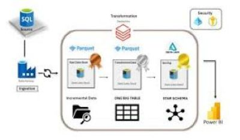
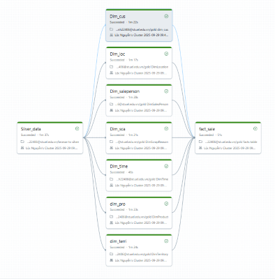
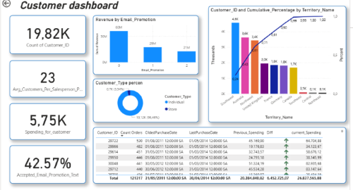

# 🚀 Azure End-to-End Data Engineering Project

## Overview
This project demonstrates a **complete end-to-end data engineering pipeline** built on **Microsoft Azure**.  
It simulates how real-world organizations handle data — from raw data ingestion to data transformation, storage, and visualization.

The goal is to build a **fully automated ETL/ELT pipeline** and develop job-ready skills for a **Data Engineer** role.

---

## Architecture Overview

The solution follows a **three-layered data architecture** (Bronze → Silver → Gold):

1. **Data Source (Raw Data)**
   - CSV files, APIs, or on-premises databases. **Incremental load** from sqlserver onpreme to azure SQL database
     
2. **Azure Data Lake Storage Gen2**
   - Stores data in three layers transfrom by using **Pyspark** :  
     - **Bronze:** Raw data from azure SQL database
     - **Silver:** Cleaned and transformed data  
     - **Gold:** Data model star Schema with 7 Dim and 2 Fact table for sale.
      
3. **Azure Data Factory**
   - Orchestrates the ETL/ELT pipelines.
   - Load data from ompreme service to Cloud data base
     
     
     
   - Handles data ingestion, **Incremental load** to bronzen container, transformation, and scheduling.  

      
     
4. **Azure Databricks**
   - Performs data cleaning, transformation, and analytics using **PySpark** .
   - Create **Surrogate Keys** for Dim tables.
   - Apply **Slowly Changing Dimention** in load data for Dim table from silver to gold.
   - Builds fact and dimension tables for reporting.
   - **Incremental load** when load data through bronzen -> silver -> gold.
   
   

   The data model here:
   
   
   
6. **Azure SQL Database / Synapse SQL Pool**
   - Stores processed data in a structured format for business intelligence.

7. **Power BI**
   - Connects to the **Synapse**.  
   - Creates 5 interactive dashboards and reports for sale and production.
   - There are my dashboard in the project:
   - 
     

     

   
     
  

     
     
  

     
     

---

## Technologies Used

| Service / Tool | Purpose |
|-----------------|----------|
| **Azure Data Lake Storage Gen2** | Store raw and processed data |
| **Azure Data Factory** | Orchestrate and automate ETL pipelines |
| **Azure Databricks PySpark** | Perform large-scale data processing |
| **Azure Synapse Analytics** | connect data from gold layer to power BI |
| **Azure SQL Database** | Store structured data for BI |
| **Power BI** | Data visualization and reporting |
| **Azure Key Vault** | Secure connection strings and credentials |

## ETL Skill Used
- Incremental load
- Full load
- Sloyly Changing Dimention
- Log changing
---

## Deliverables
- Fully automated ETL/ELT pipeline.
- Increate load, slowly chanching by pyspark.
- Load py azure factory and Transform data by pyspark 
- Data warehouse ready for reporting and analytics.  
- Power BI dashboards with KPIs such as sales, revenue, customer insights, and region-based performance.  
- Cloud-based, scalable, and secure architecture.

---

## Learning Outcomes
- Understand how to design and implement modern data pipelines on Azure.  
- Gain hands-on experience with cloud-based ETL and data warehouse tools.  
- Learn real-world data engineering workflows for portfolio or interview use.

